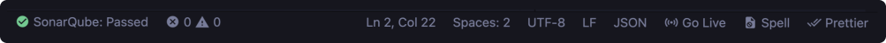
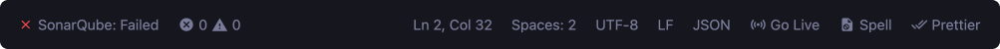
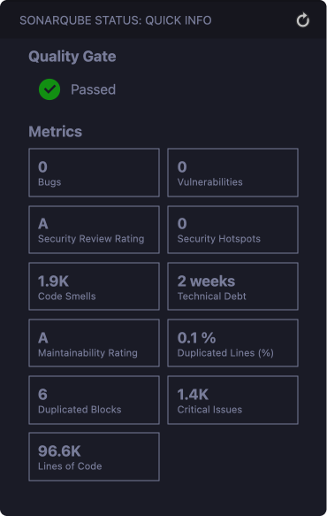

# SonarQube Project Status Plus

This extension is a maintained fork of [SonarQube Project Status](https://github.com/adisreyaj/vscode-sonarqube-status) originally created by [Adithya Sreyaj](https://github.com/adisreyaj).

## Why this fork?

The original project has been inactive since 2022 with several pending issues and pull requests. This fork aims to:
- Maintain active development and support
- Fix existing bugs and issues
- Add new features and improvements
- Provide timely responses to community contributions

## Recent Improvements
- Fixed SonarQube API integration issues
- Added better error logging and debugging
- Updated dependencies to latest versions
- Improved TypeScript type safety
- Added modern VS Code features support

## Features

1. Status bar item for quick Quality Gate Status visibility
   
   

2. Detailed metrics in the dedicated SonarQube section
   

3. Quick refresh button to update results

## Setup

1. Install the extension
2. Click on the SonarQube logo in the activity bar or run the command:
   ```
   SonarQube: Get Report
   ```
3. Configure SonarQube settings using one of the following methods:

### Using project.json Configuration (Takes Precedence)

Create `.vscode/project.json` with your configuration:

```json
{
  "project": "your_project_key",
  "sonarURL": "https://your.sonarqube.url",
  "token": "your_token"
}
```

You can also use a minimal configuration and let environment variables handle the rest:
```json
{
  "project": "your_project_key"
}
```

### Using Environment Variables (Fallback)

Set the following environment variables:
```bash
SONAR_HOST_URL=https://your.sonarqube.url
SONAR_TOKEN=your_token
```

**Note**: Configuration in project.json takes precedence over environment variables. Environment variables are only used for settings not defined in project.json.

## Development

```bash
# Install dependencies
npm install

# Build
npm run build

# Install the extension locally
npm run install-extension
```

## Contributing
Contributions are welcome! Please feel free to submit a Pull Request.

## License
This project is licensed under the MIT License - see the LICENSE file for details.

## Acknowledgments
- Original author: [Adithya Sreyaj](https://github.com/adisreyaj)
- Original project: [vscode-sonarqube-status](https://github.com/adisreyaj/vscode-sonarqube-status)
